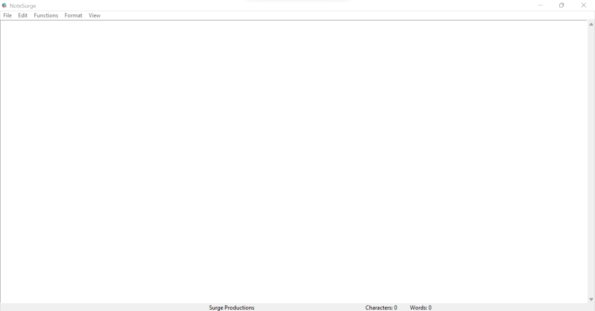

# NoteSurge

## What is NoteSurge?

- **_NoteSurge_** is a Text Editor Designed to make the Typing Experience even Better.

- It is created to help in the basic foundation for **_Surge Operating System (Surge OS)_**

### Features

1. Provides the Basic Cut, Copy and Paste Features

2. Automatically Wraps Text

3. Has Status Bar with Word And Character Count

4. Asks For Verification on Ceertain Application Request

5. Has exception handling to notify you about corrupted files

### Special Feature

#### This Browser also provides some special features

- This includes Highlight, Underline, Bold, and Italic. However these features do not save with your file and are just for viewing purposes

## Upcoming Features

- Tools for Format Menu to Be Added Soon

- AutoSave feature to be added soon

- Improvements to the New files Feature

- Search for and Change Occurences to Be Coming Soon

- EXE file coming soon

- Tab Feature Coming Soon

- Other Features To Be Added

- Font Family and Font Size Selection to be added

- Color Picker to be added (Viewing Purposes Only - Not saved with file)

- Comments for code coming soon

# Photos

# Please Note

1. This README.md file is subject to change

2. All updates will be provided

# Contact Information And Other Links

#### At Current I can be contacted by two ways

- Contact Me Via Discord: KingSurge#9182

- Contact Me Via Email : kingsurge001@gmail.com
